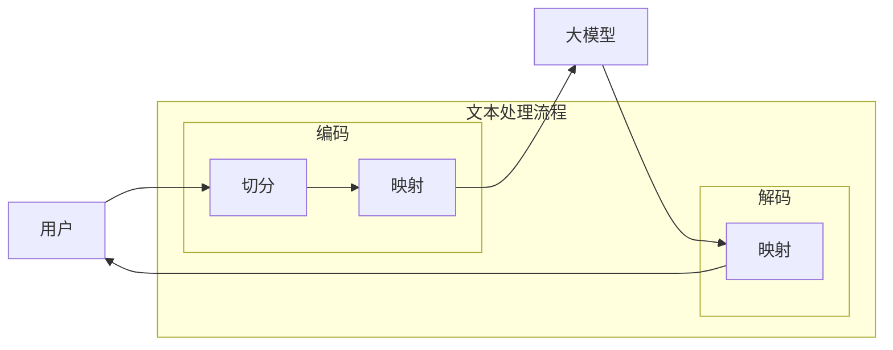

```mermaid
flowchart LR
    U[用户]
    M[大模型]

    %% 外层包裹：文本处理阶段
    subgraph Pipeline[文本处理流程]
        
        %% 编码模块
        subgraph Encoder[编码]
            E1[切分]
            E2[映射]
        end

        %% 解码模块
        subgraph Decoder[解码]
            D1[映射]
        end

    end

    %% 流程连接
    U --> E1
    E1 --> E2
    E2 --> M
    M --> D1
    D1 --> U
```