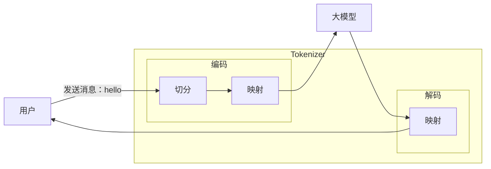

```mermaid
flowchart LR
    %% 左右主节点
    U[用户]
    M[大模型]

    %% 中间层
    subgraph Pipeline[Tokenizer]
        direction LR

        subgraph Encoder[编码]
            E1[切分]
            E2[映射]
            E1 --> E2
        end

        subgraph Decoder[解码]
            D1[映射]
        end
    end

    %% 关键：用“内部节点”连接，而不是 subgraph
    U -- 发送消息：hello --> E1
    E2 --> M
    M --> D1
    D1 --> U
```