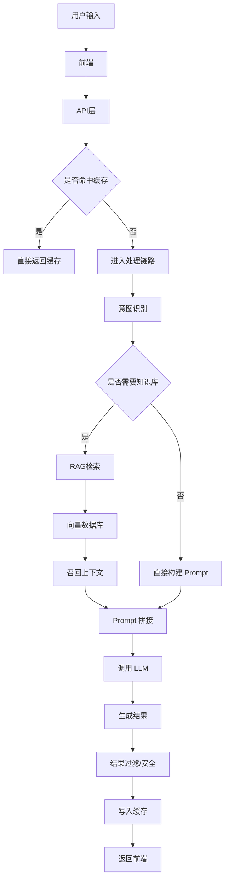

```mermaid
flowchart TD
    A[用户输入] --> B[前端]
    B --> C[API层]

    C --> D{是否命中缓存}
    D -- 是 --> E[直接返回缓存]
    D -- 否 --> F[进入处理链路]

    F --> G[意图识别]
    G --> H{是否需要知识库}

    H -- 是 --> I[RAG检索]
    I --> J[向量数据库]
    J --> K[召回上下文]

    H -- 否 --> L[直接构建 Prompt]

    K --> M[Prompt 拼接]
    L --> M

    M --> N[调用 LLM]
    N --> O[生成结果]

    O --> P[结果过滤/安全]
    P --> Q[写入缓存]

    Q --> R[返回前端]
```