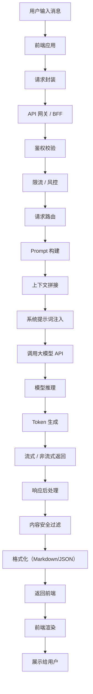

```mermaid
flowchart TD
    A[用户输入消息] --> B[前端应用]
    B --> C[请求封装]
    C --> D[API 网关 / BFF]

    D --> E[鉴权校验]
    E --> F[限流 / 风控]
    F --> G[请求路由]

    G --> H[Prompt 构建]
    H --> I[上下文拼接]
    I --> J[系统提示词注入]

    J --> K[调用大模型 API]

    K --> L[模型推理]
    L --> M[Token 生成]
    M --> N[流式 / 非流式返回]

    N --> O[响应后处理]
    O --> P[内容安全过滤]
    P --> Q[格式化（Markdown/JSON）]

    Q --> R[返回前端]
    R --> S[前端渲染]
    S --> T[展示给用户]
```