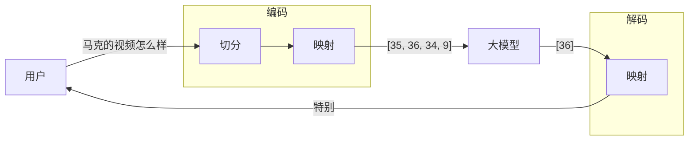

```mermaid
flowchart LR
    %% 用户
    U[用户]

    %% 编码模块
    subgraph Encoder[编码]
        E1[切分]
        E2[映射]
    end

    %% 解码模块
    subgraph Decoder[解码]
        D1[映射]
    end

    %% 模型
    M[大模型]

    %% 正向流程
    U -- "马克的视频怎么样" --> E1
    E1 --> E2
    E2 -- "[35, 36, 34, 9]" --> M

    %% 反向流程
    M -- "[36]" --> D1
    D1 -- "特别" --> U
```