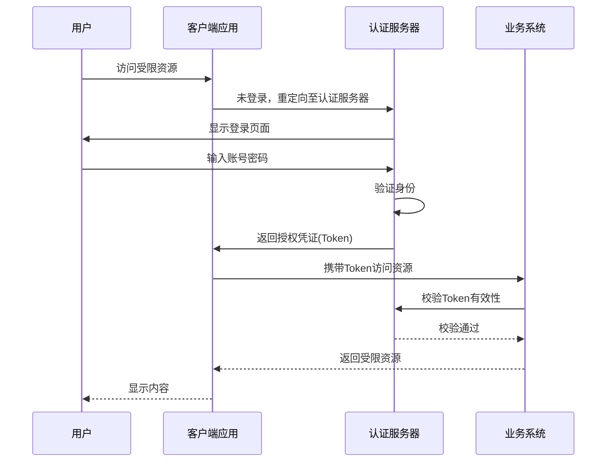

```mermaid
sequenceDiagram
    participant U as 用户
    participant C as 客户端应用
    participant AS as 认证服务器
    participant S as 业务系统

    U->>C: 访问受限资源
    C->>AS: 未登录，重定向至认证服务器
    AS->>U: 显示登录页面
    U->>AS: 输入账号密码
    AS->>AS: 验证身份
    AS->>C: 返回授权凭证(Token)
    C->>S: 携带Token访问资源
    S->>AS: 校验Token有效性
    AS-->>S: 校验通过
    S-->>C: 返回受限资源
    C-->>U: 显示内容

```